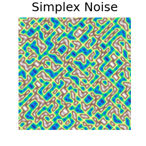

# 🌫️ Pytorch-Noise-Methods

This repository enables **easy use of numerous noise formulas** with **PyTorch implementation in Python**.  
It operates with **minimal latency** thanks to specialized optimization techniques for **GPU** and **high-speed matrix operations**.

## Features:

- **Easy operation and integration for ML.**
- **Parallel computing engine thanks to GPU-accelerated matrix multiplications.**
- **Easy visualization with matplotlib.**

### To run the code use this command 👇
While in the project root directory (src), copy the code below and execute it.

```bash
python -m src.core.perlin
```

## Preview:


## Try In Collab 👇
[](https://colab.research.google.com/drive/12vHh-88utMmqnkKY69_glVnV6jV6mTNd?)

## Supported Noise Types:

- **Perlin Noise**  
- **Fractal Noise**  
- **White Noise**  

> More noise types will be added in future updates


## 📜 License

This repository is licensed under the **[GNU General Public License v3.0 (GPL-3.0)](https://www.gnu.org/licenses/gpl-3.0.en.html)**.
